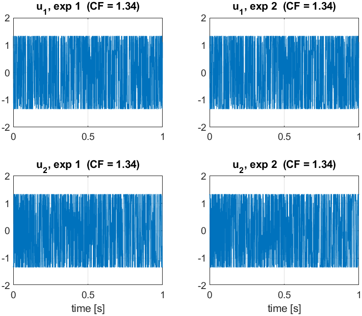
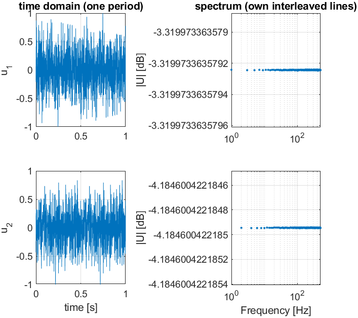
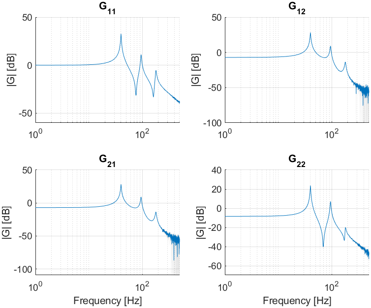
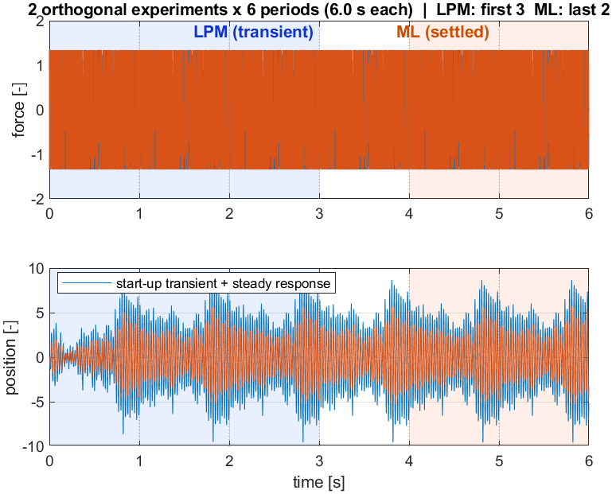
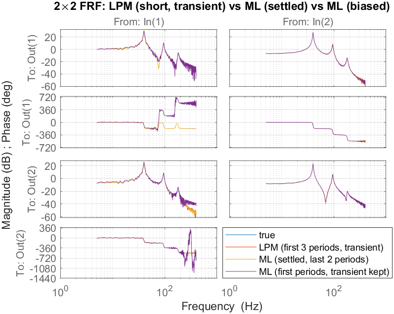
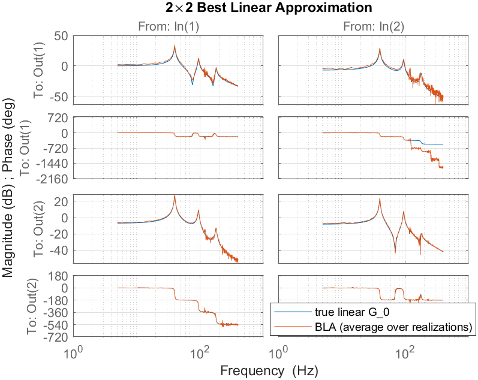
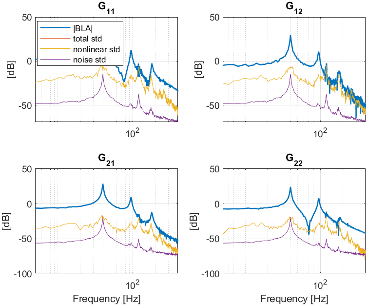
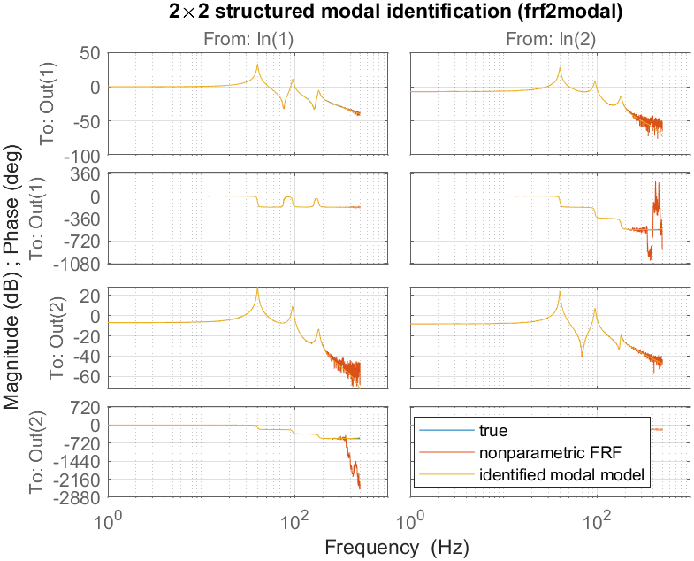
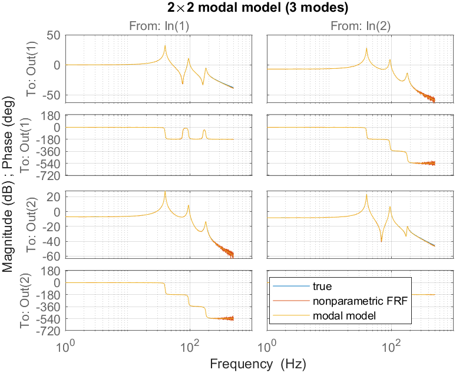

> 🇬🇧 English: [Examples_Steps_MIMO.md](Examples_Steps_MIMO.md)

# FdiTools 3.0 — MIMO ステップ例

多入力ワークフロー（`Examples/Step_MIMO1` … `Step_MIMO6`）の結果ギャラリー。共通の 2×2 ランク 1 モーダルベンチマーク `mimobench`（モード ≈ 40 / 95 / 180 Hz）を用いる。
[SISO ステップ](Examples_Steps_SISO_JP.md)、
[SISO チュートリアル](Examples_Tutorials_SISO_JP.md)、[MIMO チュートリアル](Examples_Tutorials_MIMO_JP.md) も参照。

---

## ステップ MIMO 1 — 励振設計（直交およびジッパー）
`n_in` 個の実験にわたる直交（アダマール）マルチサインに加え、各入力がインターリーブされた励振線を保有する単一レコードのジッパー設計。




*スペクトルは励振線にわたって平坦である（すべての線が同一振幅を持つため、y 軸は浮動小数点レベルまで自動的にズームインする）。*

---

## ステップ MIMO 2 — フル 2×2 FRF（直交およびジッパー）+ 信頼区間バンド
直交多重実験推定と単一ジッパー推定はいずれもフル 2×2 FRF（周波数応答関数）を復元する（`time2frf_ml`）。各要素ごとの 95% 信頼区間バンドは `sG` から得られる。




---

## ステップ MIMO 3 — MIMO LPM（位置決め）
短く過渡で汚染されたレコードからの直交・フル分解能 MIMO 局所多項式法 (LPM)。主要な共振（G₁₁ の 40 Hz ピークを含む）が捉えられ、LPM の誤差は整定後 ML に一致する一方、過渡を含む ML ははるかに劣る。





---

## ステップ MIMO 4 — 非線形ひずみ（ロバスト BLA）
M 個の独立したランダム位相実現 → 最良線形近似（Best Linear Approximation）。実現間のばらつき（全体）から周期間のばらつき（雑音）を差し引くと、確率的非線形ひずみのレベルが得られる。ここではこれが雑音を 20–30 dB 上回って支配的となる。



*各要素ごと: |BLA|、全体の標準偏差、非線形の標準偏差、雑音の標準偏差 — 非線形 ≫ 雑音。*

---

## ステップ MIMO 5 — 構造化モーダル同定
`frf2modal`（ランク 1 留数、加法的→モーダルの 2 段階、van der Hulst et al. MSSP 2026）は 2×2 FRF にモーダルモデルを当てはめ、真のプラントと非パラメトリック FRF を重ね描きする。



---

## ステップ MIMO 6 — モデル選択と検証
柔軟モードの数をスイープし（雑音正規化コストは真の個数 3 で下限に落ち込む）、続いて検証する。モデル化誤差は周波数全体にわたって FRF の不確かさ σ_G の位置にある。





```
--- identified modal parameters (selected order = 3) ---
 mode |  wn_true   wn_est [Hz] |  z_true    z_est
   1  |    40.00     40.00     |  0.010    0.010
   2  |    95.00     95.00     |  0.015    0.015
   3  |   180.00    179.98     |  0.020    0.020
modal-model FRF fit vs true : 98.52 %
noise-normalized cost       : 2.63
```
