> 🇬🇧 English: [Examples_Steps_SISO.md](Examples_Steps_SISO.md)

# FdiTools 3.0 — SISO/SIMO Step examples

単入力ワークフロー（`Examples/Step_1` … `Step_6`）の結果ギャラリーです。
例を実行したあと、`savefigs('<name>')`（または `export_all_figs`）で
`Examples/plot/` 内の画像を再生成できます。あわせて [MIMO Steps](Examples_Steps_MIMO_JP.md)、
[SISO Tutorials](Examples_Tutorials_SISO_JP.md)、[MIMO Tutorial](Examples_Tutorials_MIMO_JP.md) も参照してください。

---

## Step 1 — 励振設計（マルチサイン）
ランダム／Schroeder マルチサインの設計です。時間信号、励振線スペクトル、波高率を示します。
波高率が低い（≈1.4）ほど、エネルギーを励振線へ効率よく集約できます。

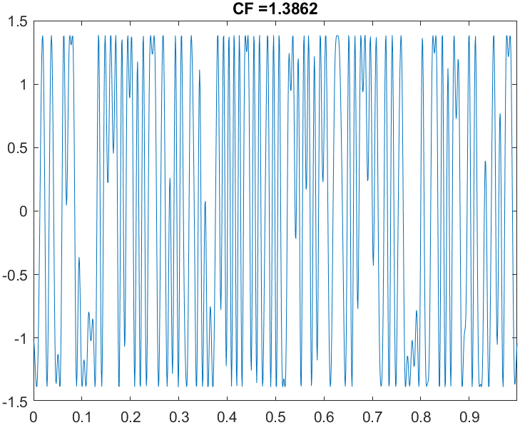
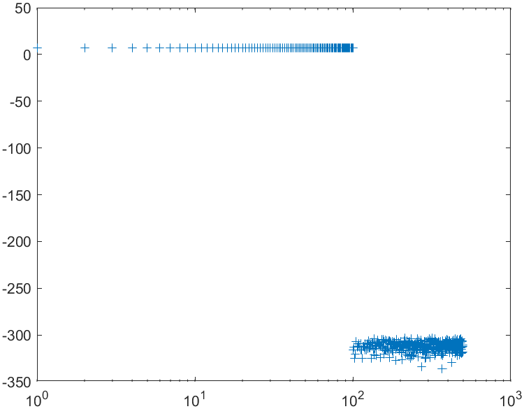

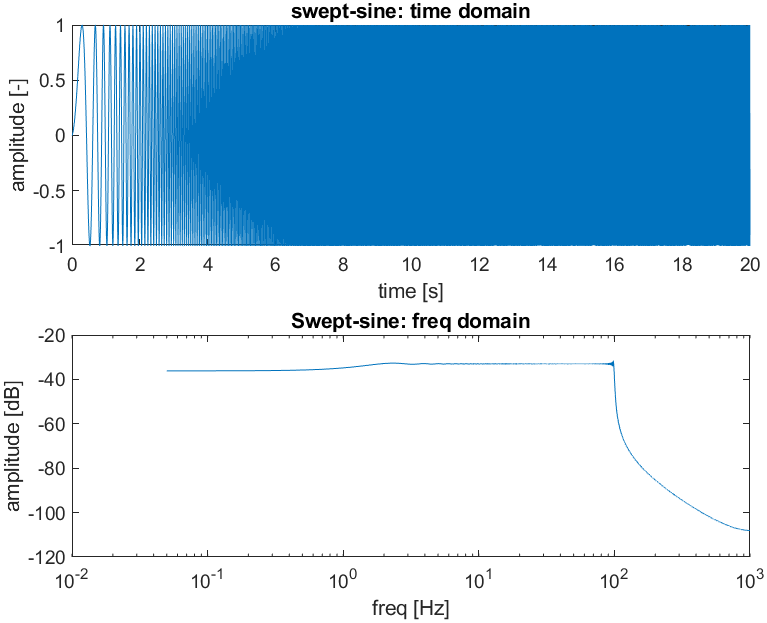

---

## Step 2 — ノンパラメトリック FRF（周波数応答関数）＋不確かさ
モータベンチに対する周期最尤 FRF（周波数応答関数）（`time2frf_ml`）です。FRF（周波数応答関数）の
標準偏差 `UserData.sG` と 95% 円形信頼区間バンド（`frfconf`）が不確かさを定量化します。
平均する周期数が少ないほどバンドは広がります。

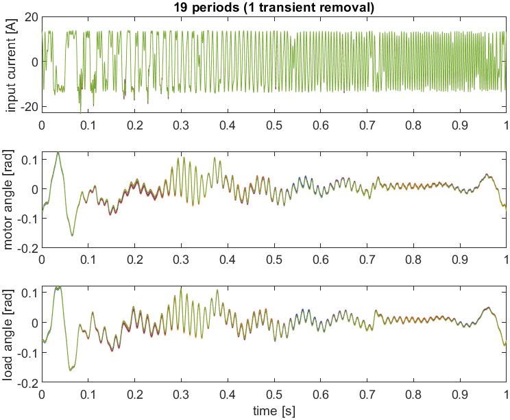
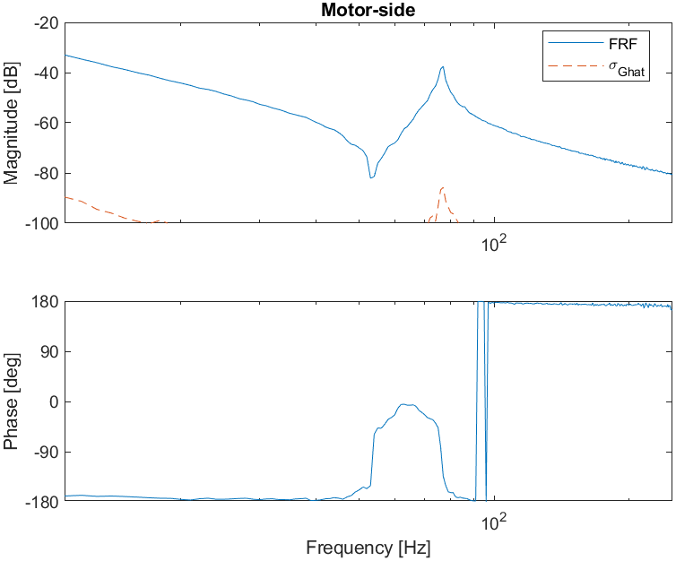

*負荷側 FRF（周波数応答関数）と FRF 標準偏差 σ_G（信号より ≈40–60 dB 下）。*

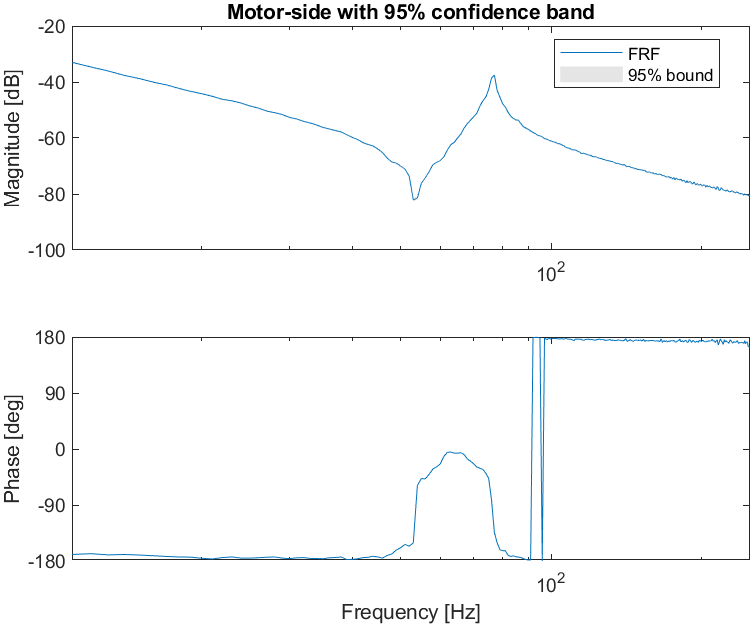
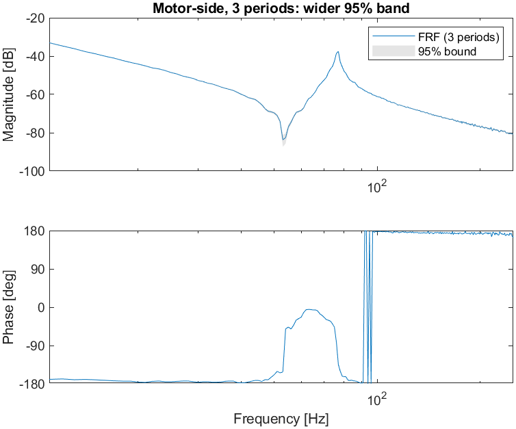
*周期がわずか 3 つの場合、反共振点で 95% バンドが目に見えて広がります。*

---

## Step 3 — 局所多項式法 (LPM)：熱炉
ヒータ→温度（低域通過、時定数は数時間）。冷えた状態から始めると長い熱的過渡が生じます。
LPM は非励振線からこの過渡をモデル化するため、**短い**記録でも整定を待たずに低バイアスな
FRF（周波数応答関数）が得られます。一方、古典的な ML は過渡を残したままだとバイアスを生じます。

**LPM が大きな過渡を除去する仕組み** — 時間領域では、冷間始動の過渡（0→150 °C）が
小さな励振リプルを覆い隠してしまいます。しかし P 周期 DFT では、過渡は*滑らかな*スペクトル寄与であり、
すべてのビンに存在します。したがって励振線の間にある非励振ビンには過渡だけが現れます。
そこで低次多項式をこれにあてはめ、各励振線で差し引きます
（`Y0 = Y(K) − t0`、`Ĝ = Y0/U(K)`）：


**シミュレーションでの実例**（`Examples/lpm_explained.m` を実行）。記号：

- **N** = 1 周期あたりのサンプル数（`N = fs/df`；ここでは 200）、
- **P** = LPM 記録に含まれる周期数（ここで使う最初の `nL = 4` 周期なので
  `P = 4`）、
- 解析はそのブロック全体に対する**1 回の PN 点 DFT**（`PN = P·N = 800`
  点）であり、周期ごとの変換では*ない*。PN グリッド上では励振線が
  **P 番目ごと**のビンに位置し、その間にある `P−1` 個のビンは過渡のみを担います。

複素平面パネル（右下）は、ある 1 つの励振線 *K* における様子を示します。
非励振の隣接点（ビン `K±m`）が滑らかな過渡をなぞり、多項式が *K* での過渡 `t0` を与え、
`Y0 = Y(K) − t0` が復元された信号です（`Ĝ = Y0/U(K)`）。


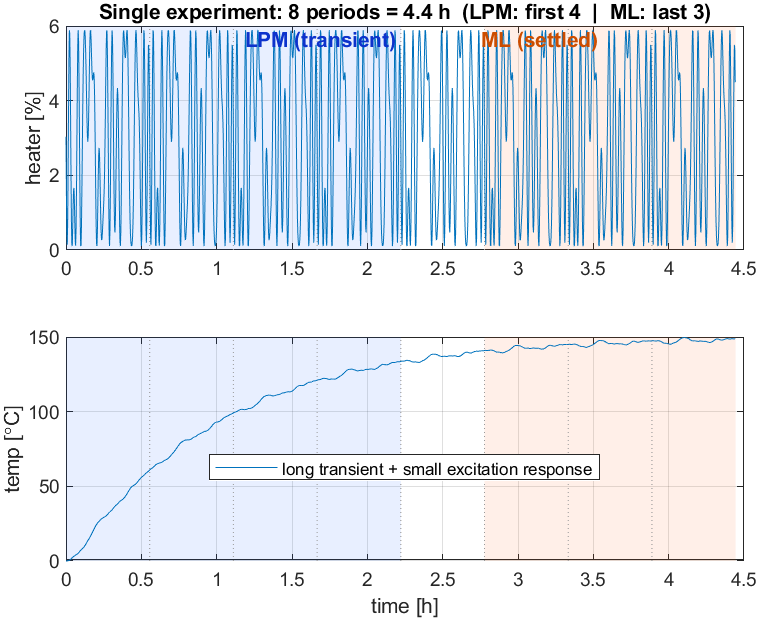
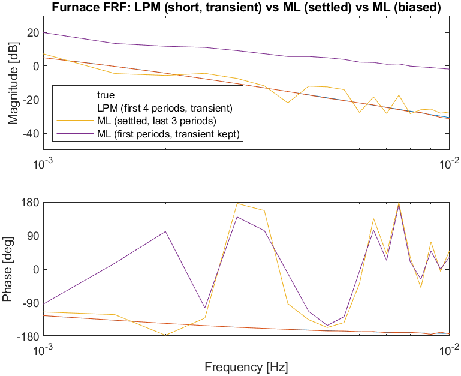
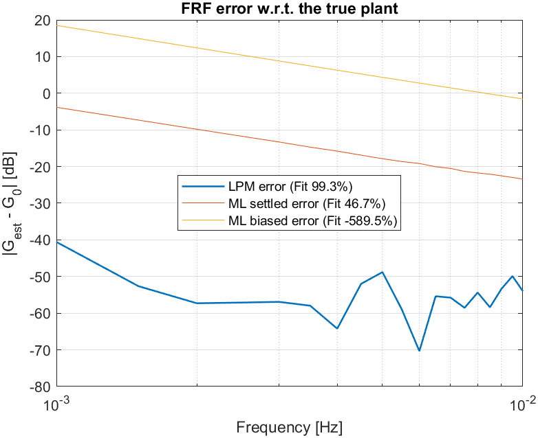

```
FRF fit vs true plant
LPM (first 4 periods, transient)   :  99.3 %
ML  (settled, last 3 periods)      :  46.7 %
ML  (first periods, transient kept): -589.5 %
```

## Step 3 — 局所多項式法 (LPM)：位置決めステージ
力→速度のベンチマークです。静止状態から始めると、減衰の小さい共振が鳴り続けます。
LPM は初期（過渡）周期から FRF（周波数応答関数）を復元し、整定後の周期に対する ML と
同等の品質を達成します。過渡を残したままの ML よりもはるかに優れています。

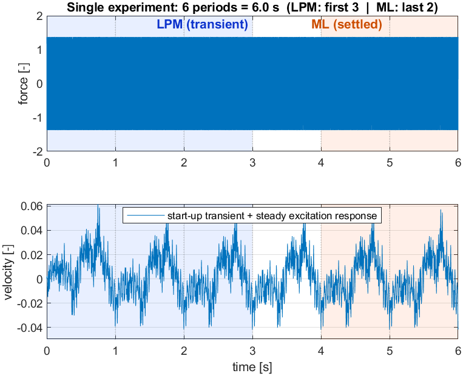
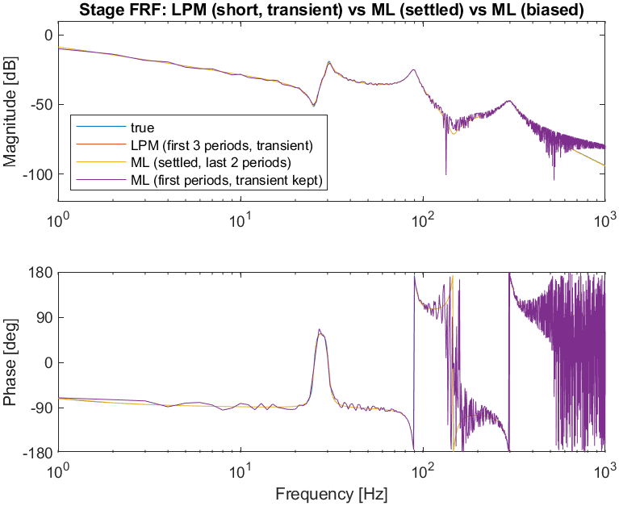


```
FRF fit vs true plant
LPM (first 3 periods, transient)   :  99.5 %
ML  (settled, last 2 periods)      : 100.0 %
ML  (first periods, transient kept):  87.4 %
```

---

## Step 4 — 非線形ひずみの検出
奇-奇ランダム位相マルチサインです。出力スペクトルは線形寄与、偶／奇の非線形ひずみ、
そして雑音フロアに分離されます。ここでは、ひずみは線形応答より十分に下に位置しています。


---

## Step 5 — パラメトリック推定
決定論的（WLS/NLS/LS）および確率論的（MLE/BTLS/GTLS）な単一分母推定器を FRF（周波数応答関数）に
あてはめます。不確かさ `sG` が達成可能なフィットの限界を与えます。

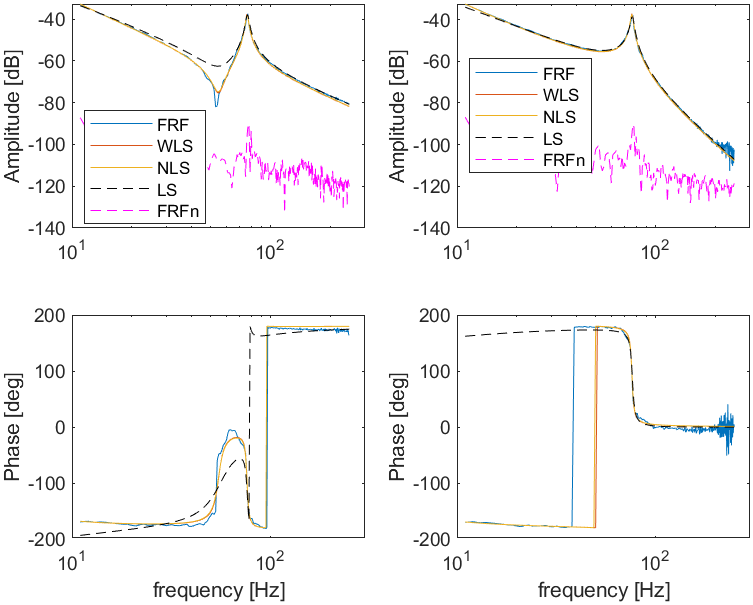
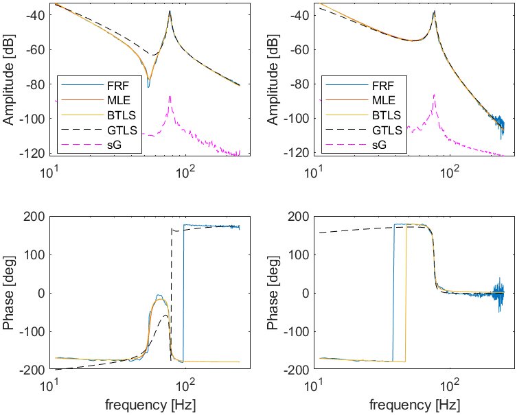

---

## Step 6 — モデル選択と検証
3 つの独立した検定が 2 つの問いに答えます。すなわち**どの推定器が最良か**、そして
**モデルは妥当か**です。対象は 2 慣性モータベンチ（共振 1 つ、出力 2 つ θ_m, θ_l）で、
6 つの推定器（gtls / ls / wls / nls / ml / btls）であてはめます。

| 検定 | 確認する内容 | 基準 |
|---|---|---|
| 1 — 残差白色性 | 残差の**形状**（相関） | 白色雑音の信頼限界 |
| 2 — 残差コスト | 残差の**水準**（雑音まで下がっているか？） | 雑音フロア（E[V] ≈ F − nθ） |
| 3 — χ² モデリング誤差 | **測定不確かさ**に対するモデル誤差 | FRF の CR 限界 σ_Ĝ（= sCR） |

### 検定 1 — 残差白色性（出力ごとに 1 図）
ラグに対する残差自己相関です。**実線の黒 = 95 %** 限界、**破線 = 50 %** 限界で、
タイトルには各限界を超えるラグの割合が示されます。*白色*残差は 95 %／50 % 限界をそれぞれ
≈5 %／50 % の頻度でしか超えないため、**超過が小さい = 良好**（未モデル化のダイナミクスが残っていない）
を意味します。残りサンプル数が減るため、大きなラグで限界は広がります。


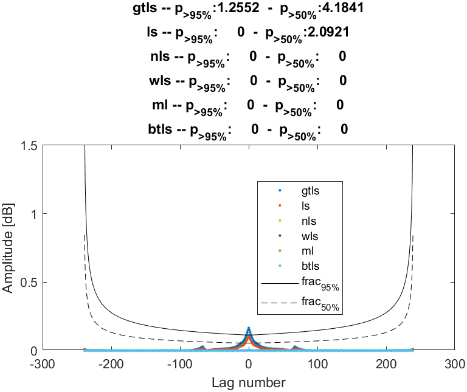

### 検定 2 — 残差コスト（推定器の比較）
推定器ごとに 1 本のバー（青 = H₁₁ iq→θ_m、赤 = H₁₂ iq→θ_l）で、**破線は雑音水準**です。
バーが雑音フロア近傍 ⇒ 残差は実質的に雑音（良好）、フロアより大きく上 ⇒ **モデル誤差／バイアス**が
残っています。順序としては、**gtls / ls が最悪**（ls は雑音重み付けを無視し、gtls は
誤差混入変数構造の重み付けを誤る）で、wls → nls → ml → **雑音フロアに到達する btls** へと
改善します。これは理論の予測どおりです（入力*および*出力の雑音を正しく扱う推定器が効率的）。


> 検定 1 が合格しつつ、検定 2 がフロアよりわずかに上にとどまることがあります。これは
> 矛盾ではありません。検定 1 は残差の**形状**、検定 2 はその**水準**だからです
> （「集中した残りはないが、小さな広帯域誤差が残っている」）。

### 検定 3 — χ² モデリング誤差 vs CR 限界（出力ごとに 1 図）
周波数ごとに、モデリング誤差 `|G_model − Ĝ_meas|`（色付き）を測定不確かさ σ_Ĝ
（= sCR、**黒**）と比較します。黒線**より下** ⇒ 誤差が測定雑音に埋もれている → **妥当**
（このデータではこれ以上は望めない）、黒線**より上** ⇒ そこに系統的なモデル誤差がある、を意味します。
ここでは誤差は帯域全体で CR 限界を下回り、共振付近（最もあてはめが難しい領域）でそれに近づいて上昇します。

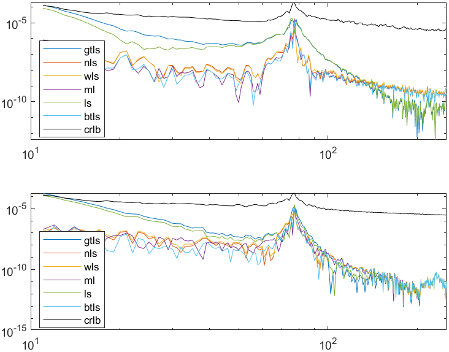

### 「CR 限界」とは何か（そして何でないか）
Cramér–Rao 限界は***推定値*の分散の下界**（`Cov(θ̂) ⪰ Fi⁻¹`）であり、実験 + 雑音 + モデル構造によって
定まります。どの推定器を使うかには**依存せず**、残差**でもありません**。検定 3 では `crlb` 線は
**ノンパラメトリック FRF（周波数応答関数）の不確かさ** σ_Ĝ（= sCR）であり、モデル誤差を判定する
測定フロアです。（検定 2 の破線「雑音フロア」はこれとは*別の*フロア、すなわち期待残差コストです。
どちらも「フロア」ですが、別個の量です。）

### 結論
- **最良の推定器：btls / ml**（残差コストが雑音フロアに最も近く、残差は白色）。**ls / gtls は避ける**
  （大きなバイアス）。
- **モデルは妥当**：残差は白色（検定 1）、モデル誤差はほぼ全域で CR 限界以下（検定 3）。
- **改善の余地**：残差コストがフロアよりわずかに上（特に H₁₁）で、共振付近で誤差が上昇 →
  モデル次数 *n* を上げる、共振周辺に励振を集中させる、または過渡除去を見直す。
- **役割**：検定 1 = 形状（白色性）、検定 2 = 水準（雑音まで下がっているか？）、
  検定 3 = 周波数ごとに測定不確かさ以下か？ この 3 つすべてが揃って「モデルは妥当」を裏付けます。
