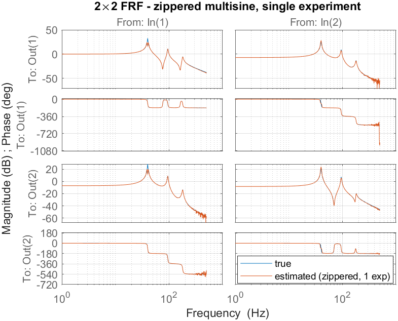

> 🇬🇧 English: [Examples_Tutorials_MIMO.md](Examples_Tutorials_MIMO.md)

# FdiTools 3.0 — MIMO チュートリアル

`Examples/Tutorial_4_MIMO` の結果ギャラリーです。本チュートリアルでは、**単一の 2×2 プラントに対する多変数ワークフロー全体**を一通りたどります。すなわち、励振の設計、2 通りの方法による FRF（周波数応答関数）の測定、そして構造化されたモーダルモデルのフィッティングです。これらは [MIMO ステップシリーズ](Examples_Steps_MIMO_JP.md) と同じベンチマーク（`mimobench`）および同じルーチンを用いているため、両者を並べて読むことができます。
[SISO ステップ](Examples_Steps_SISO_JP.md)、[SISO チュートリアル](Examples_Tutorials_SISO_JP.md) も参照してください。

## ベンチマークと設定
`mimobench` は 2 入力／2 出力の、相反性をもつ比例減衰のモーダルプラントで、3 つの柔軟モードをもちます。各モードは 2 次の分母上のランク 1 留数 `g·φφᵀ` で表されます（したがって `frf2modal` が対象とする構造に一致します）。(1,1) の DC ゲインは 0 dB に正規化されています。

| モード | 周波数 `wn` [Hz] | 減衰 `ζ` |
|---|---|---|
| 1 | 40 | 0.010 |
| 2 | 95 | 0.015 |
| 3 | 180 | 0.020 |

出力モード形状 `φ = [1 1 1; 0.6 −0.8 0.4]` は真の（ランク 1 の）相互結合を生み出すため、非対角項 `G₁₂`、`G₂₁` は物理的に意味をもちます。すなわち数値的なノイズではありません。

| 設定 | 値 |
|---|---|
| サンプリング `fs` | 2500 Hz |
| 分解能 `df` | 1 Hz |
| 励振帯域 | 1 – 500 Hz |
| 周期数 / 過渡 | `nrofp = 5` / `trans = 1` |
| 出力雑音 | `1e-3`（FRF のフロアを決める） |

---

## 方法 A — 直交マルチサイン、多重実験
`multisine(nrofi = 2)` は 2 つの直交（Hadamard）実験を生成します。各実験では両方の入力が、入力行列 `U(2×2)` をすべての励振線で可逆にするような位相パターンで駆動されます。そのため `G = Y/U` によって**すべての線で完全な 2×2 FRF** が得られます（チャネルごとに完全な分解能）。これは [Step_MIMO2](Examples_Steps_MIMO_JP.md) の MIMO FRF です。


*推定値（オレンジ）が帯域全体にわたって真のプラント（青）に重なっています。深い反共振点と高周波のロールオフ（低 SNR）のみでばらつきが見られます。*

---

## 方法 B — ジッパーマルチサイン、単一実験
記録は 1 つだけです。入力 1 は奇数の励振線を、入力 2 は偶数の励振線を励振します。どの励振線でも 1 つの入力のみがアクティブなので、各 FRF **列**を直接読み取ることができます。`time2frf_ml` が各列を完全なグリッド上へ補間します。実験は 2 回ではなく 1 回で済みますが、その代償としてチャネルごとの分解能は**半分**になります。


*非対角の相互項を含む 4 つすべての要素が真のプラントを追従しています。これは `mimobench` が有意な（ランク 1 の）結合をもつためです。チャネルごとの線間隔より鋭い共振があれば、それが制約要因となります（モードが非常に鋭い場合に用いる直交・完全分解能の LPM の代替については [Step_MIMO3](Examples_Steps_MIMO_JP.md) を参照してください）。*

---

## 構造化モーダル同定（`frf2modal`）
`mimobench` は比例減衰でランク 1 のモーダルシステムなので、`frf2modal` は**直交 FRF 推定値** `Pa` から直接モーダルパラメータを復元します。これはまさに Step_MIMO5 の流れです。2 段階法ではまず加法モデルをフィッティングし（極は非線形最小二乗、留数は変数射影による）、続いて各留数をランク 1 へ射影し（SVD）、FRF に対して精緻化します（van der Hulst et al., *MSSP* 247 (2026) 113948）。


*真のプラント、ノンパラメトリック FRF、同定されたモーダルモデルが帯域全体で重なっています。*

コンソール出力（モーダルパラメータと FRF フィット。周波数と減衰は本質的に厳密に復元されています）:

```
--- identified modal parameters ---
 mode |  wn_true   wn_est [Hz] |  z_true    z_est
   1  |    40.00     40.00     |  0.010    0.010
   2  |    95.00     95.00     |  0.015    0.015
   3  |   180.00    179.99     |  0.020    0.020
modal model FRF fit vs true : 99.08 %
```

`'damping','general'` を指定した 2 回目の呼び出しは**複素**モード形状をフィッティングします（一般粘性減衰、式 (2)、(6)、(46)）。これは比例減衰のデータもフィッティングでき、その場合の複素モード形状は本質的に実数になります。したがって減衰構造が未知の場合の安全な既定値となります:

```
general-damping wn_est [Hz] : 40.00 94.99 180.00
general modal FRF fit vs true: 99.06 %
```

---

### 再現方法
```matlab
cd Examples
addpath(genpath('../src'))
Tutorial_4_MIMO          % runs methods A & B + modal identification
savefigs('Tutorial_4_MIMO')
```

### 要点
- **直交 vs ジッパー**: 直交方式は `n_in` 回の実験を必要とするが完全な分解能が得られる。ジッパー方式は 1 つの記録で済むが、チャネルごとの分解能は半分になる。
- **1 つのベンチマークでパイプライン全体**: Step_MIMO シリーズと同じ `mimobench` とルーチン（設計 → FRF → モーダルモデル）を用いるため、結果を直接比較できる。
- **`frf2modal`** は測定された FRF から物理的なモーダルパラメータ（周波数、減衰、ランク 1 のモード形状）を、比例減衰または一般粘性減衰のもとで復元する。
