> 🇬🇧 English: [Examples_Tutorials_SISO.md](Examples_Tutorials_SISO.md)

# FdiTools 3.0 — SISO チュートリアル

単入力チュートリアルの結果ギャラリーです。あわせて
[SISO ステップ](Examples_Steps_SISO_JP.md)、[MIMO ステップ](Examples_Steps_MIMO_JP.md)、
[MIMO チュートリアル](Examples_Tutorials_MIMO_JP.md) も参照してください。

---

## チュートリアル 1 — チャープ（スイープ正弦）励振
スイープ正弦の時間／周波数信号、コヒーレンス、および推定された FRF（周波数応答関数）と真のプラントの比較。

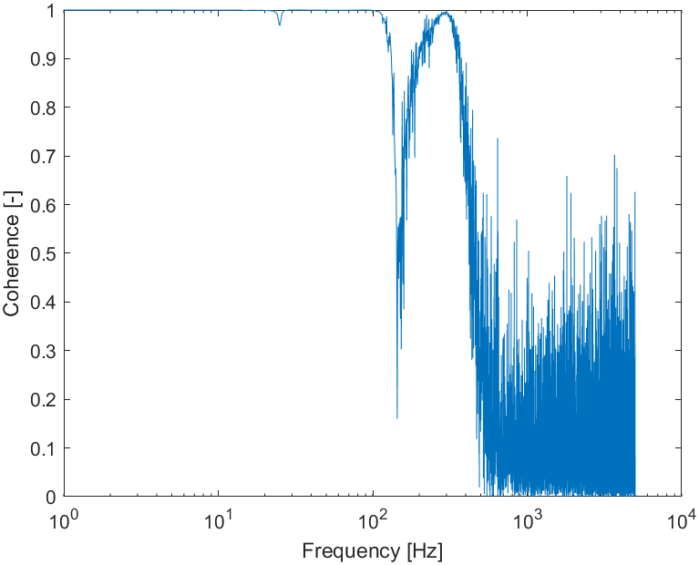

## チュートリアル 1 — ランダム励振
非周期ランダム励振：コヒーレンス（帯域内では良好で、反共振点および帯域外で低下する）と推定された FRF（周波数応答関数）。

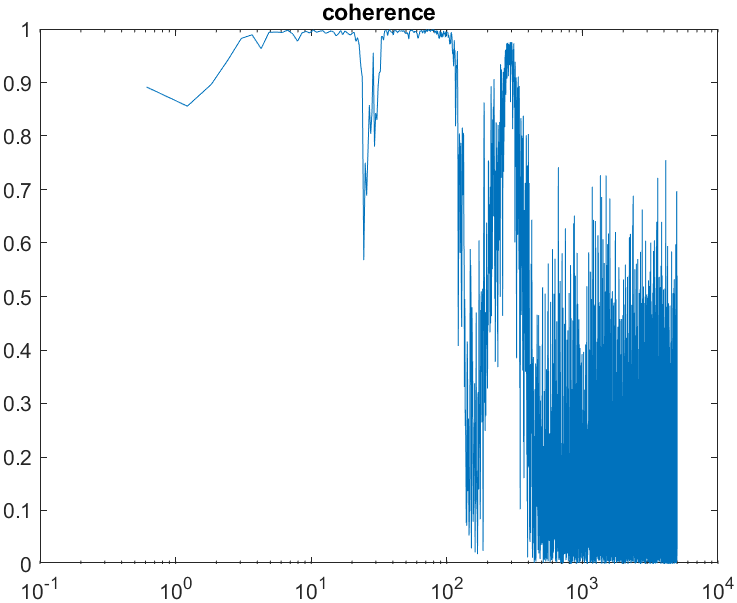
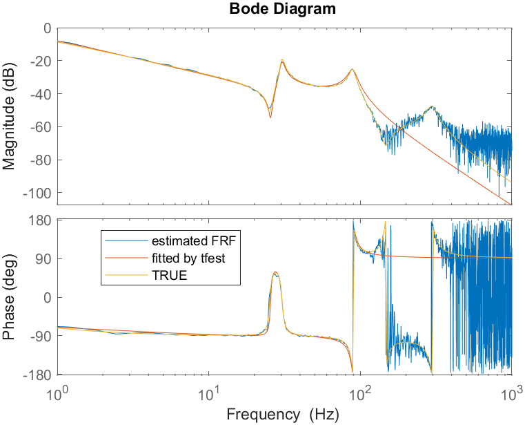

## チュートリアル 1 — 準対数マルチサイン
準対数グリッドのマルチサイン、時間領域の入出力、ノイズモデル付きの FRF（周波数応答関数）、95% 信頼区間バンド、およびパラメトリック推定量。

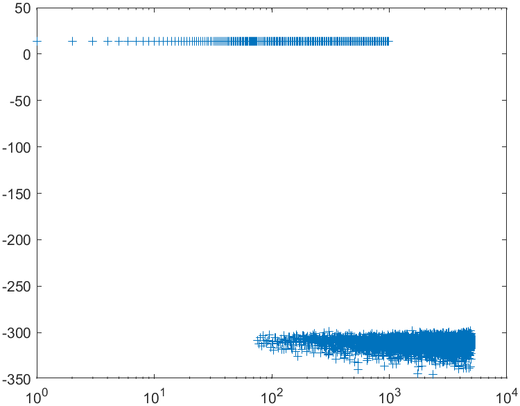

*SNR が低下する高周波域で 95% バンドが広がる。*

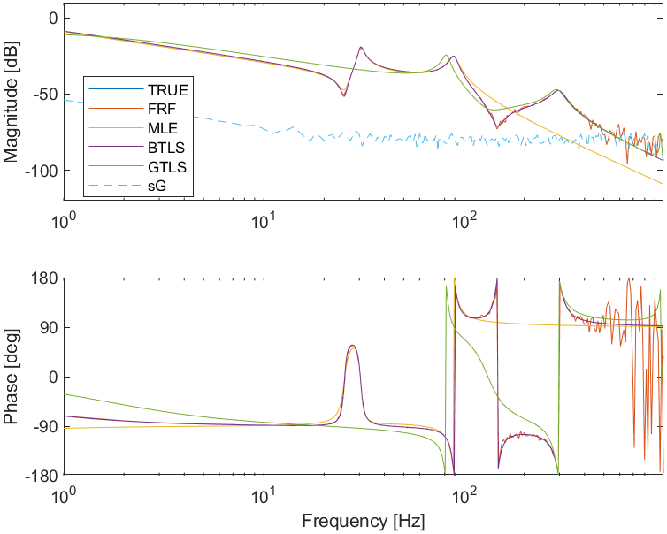
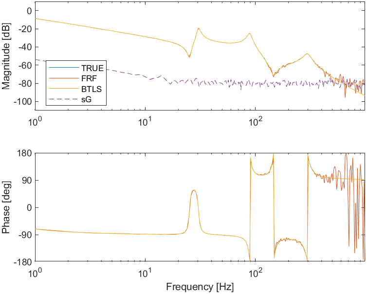

---

## チュートリアル 2 — 反復実験計画（逆 S/N）
3 つの実験 — 広帯域、続いて逆信号雑音比により精密化、さらに高周波域に集中 — を 1 つの低不確かさ FRF（周波数応答関数）へ統合する（`fcat_fdi`）。クレストファクタ最適化器は 3 つの設計に対して CF ≈ 1.69 / 1.95 / 2.22 に収束する。

3 つの実験における励振設計と帯域別 FRF：

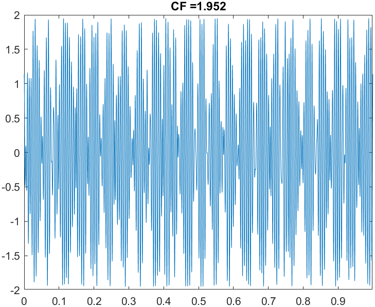
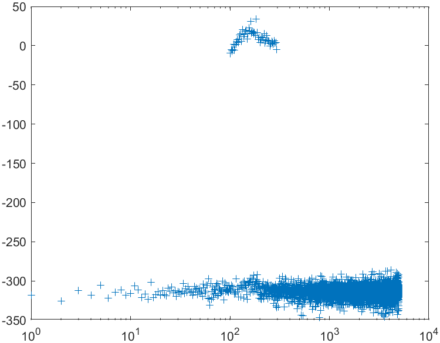

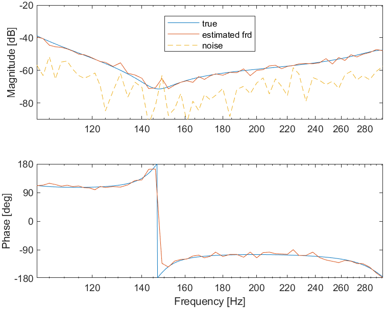

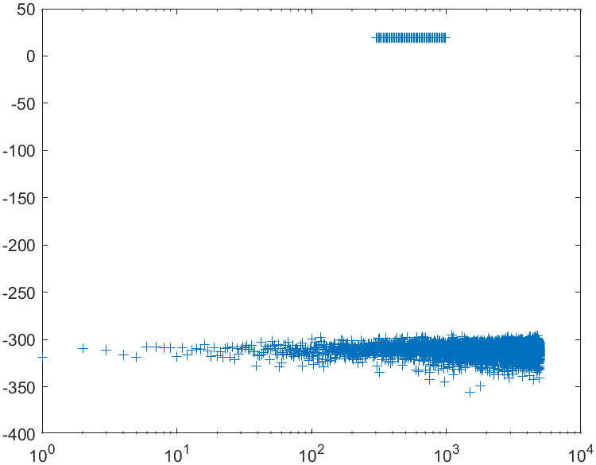

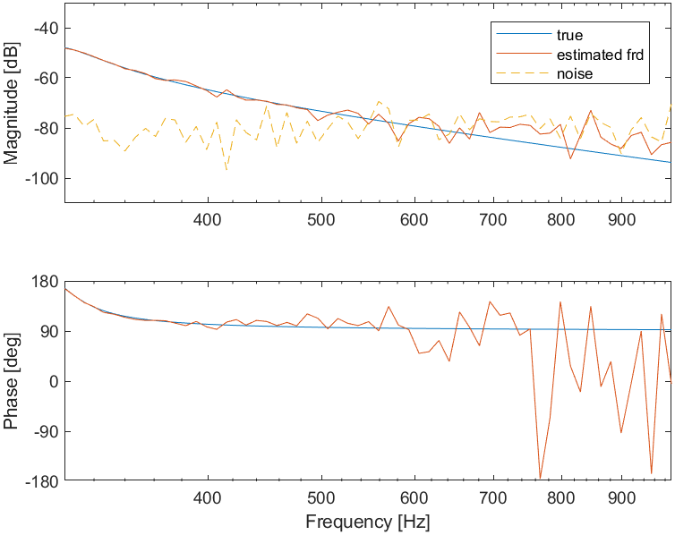
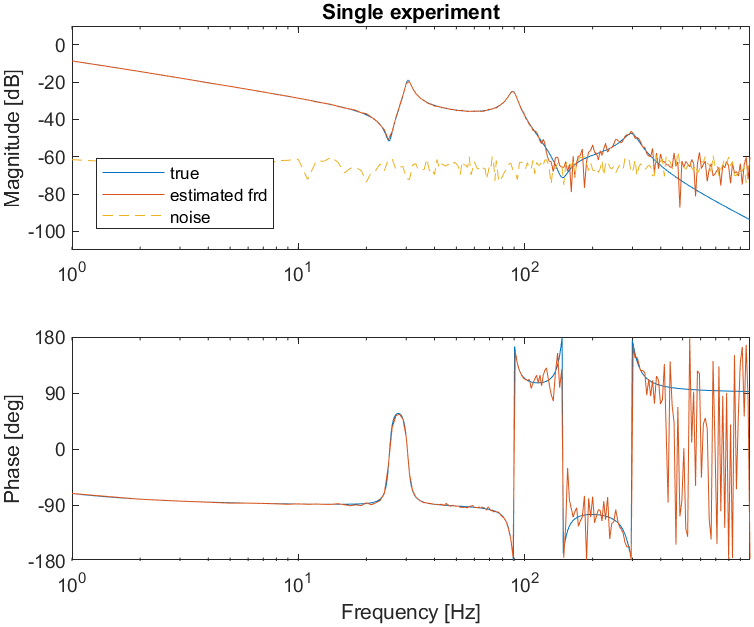

単一実験と反復実験の比較、および結果として得られる推定誤差：

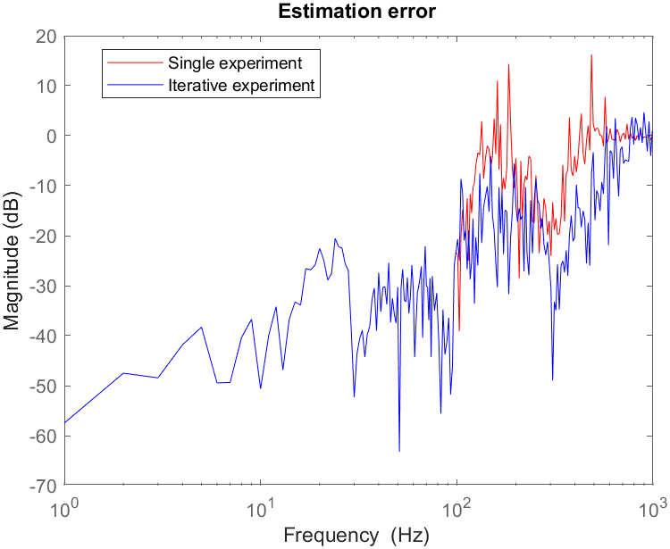
*重要な結果：反復設計により、対象とした高周波域での推定誤差が低減する。*

統合された FRF（周波数応答関数）に対するパラメトリック推定：

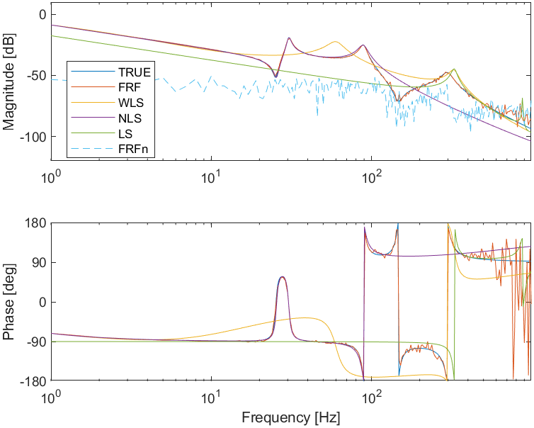
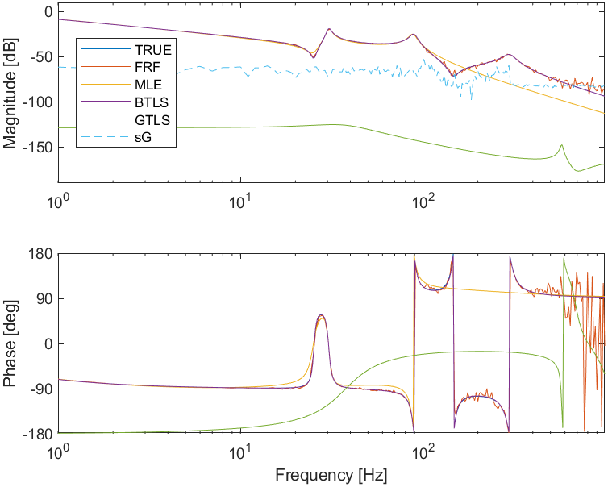
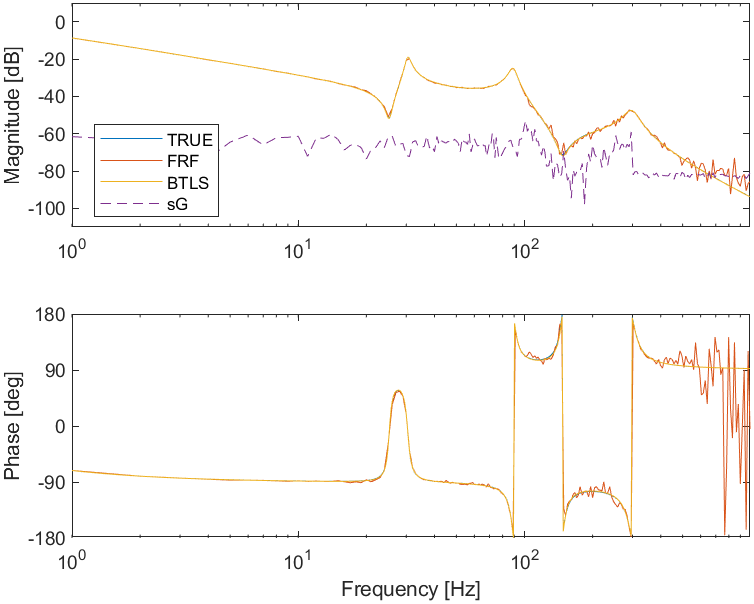
*（GTLS は粗い初期値推定量であり退化しうる。MLE/BTLS が信頼できるものである。）*

---

## チュートリアル 3 — 非線形ひずみ、入力非線形性
入力振幅を増加させた場合（および線形参照）のひずみ解析。

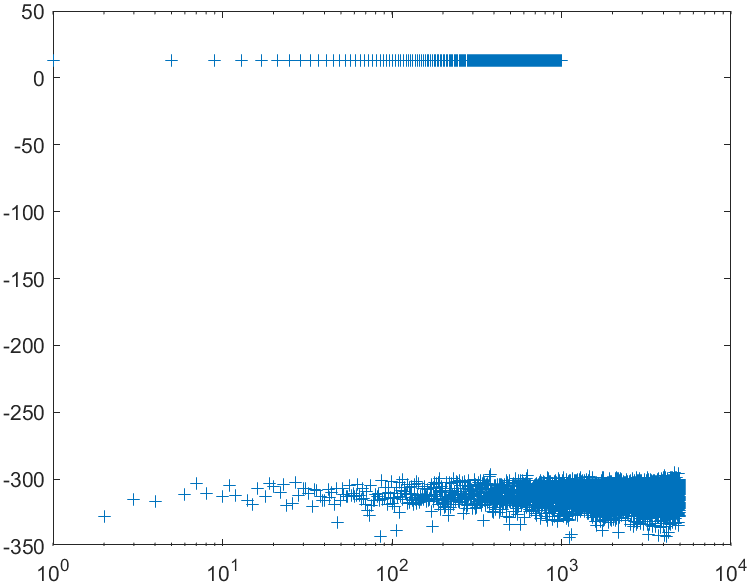
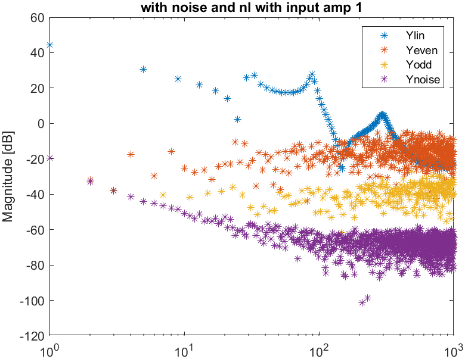

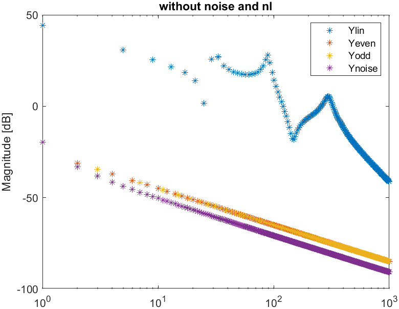

## チュートリアル 3 — 非線形ひずみ、出力非線形性
出力（Wiener 型）非線形性に対する同じスイープ。

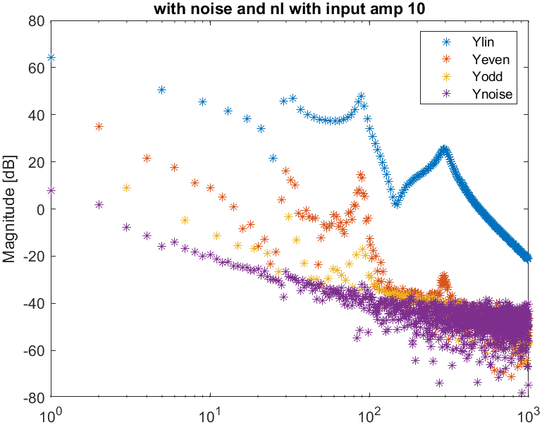

